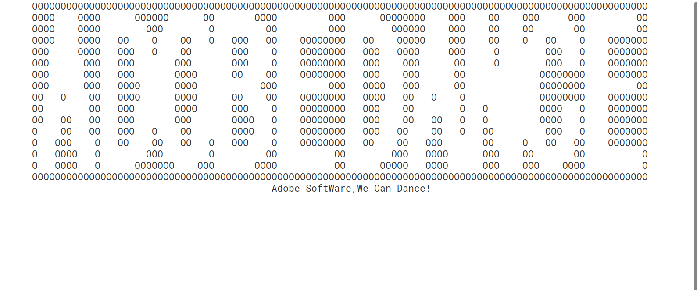

# adobe_dancing
## adobe_dancing is a simple console application
## you can see icon dancing

---
## how to use
` Usage: adobe_dance [option]`

` help           show help `

` show           show element   `

## dowload
you can  build from source

`cd $(sourc_dir) && make` 

or download deb
 
 [adobe-dancing-linux.deb](adobe-dancing-linux.deb)
